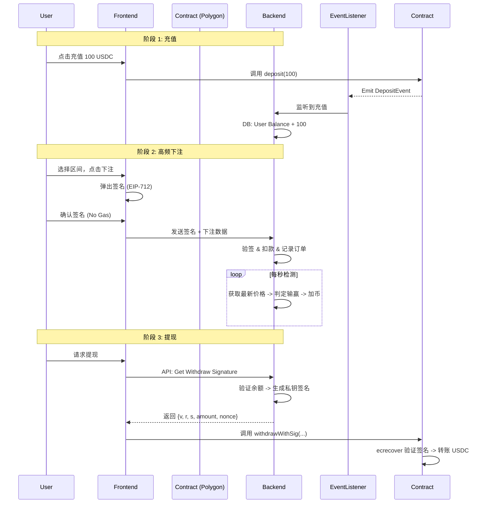

# KMarket Demo 开发实施文档 (MVP)

> **目标**: 快速构建一个基于 Polygon 的 K 线预测市场 MVP (Minimum Viable Product)。
> **核心架构变更**: 鉴于秒级高频下注需求，采用 **"链下撮合 + 链上资金托管"** 的 Layer 2 混合架构。用户充值后，下注只需签名（无需 Gas），结算在服务器端完成，提现时验证服务器签名上链。

## 1. 技术架构方案 (Hybrid Model)

为了满足高频体验，我们采用以下流程：

1.  **充值 (On-Chain)**: 用户将 USDC 充入智能合约 (`Vault`)。
2.  **下注 (Off-Chain)**: 用户在前端对下注数据进行 **EIP-712 签名**，发送给后端。
3.  **撮合与记账 (Off-Chain)**: 后端服务器验证签名，扣除用户数据库余额，记录下注。
4.  **结算 (Off-Chain)**: 后端根据实时 K 线数据（Binance/Coinbase WS）判定输赢，更新数据库余额。
5.  **提现 (On-Chain)**: 用户请求提现 -> 后端生成带有服务器私钥签名的凭证 (Coupon) -> 用户调用合约提现 -> 合约验证签名并放款。

---

## 2. 详细分工与任务列表

### 🟢 第一部分：Smart Contracts (智能合约)

**目标**: 确保资金安全，提供充值入口和经过验证的提现出口。

**开发任务**:

1.  **`KMarketVault.sol` (资金池合约)**
    *   [ ] **Deposit**: 接收用户 USDC，映射到链下账户（通过 Event 通知后端）。
    *   [ ] **Withdraw**: 核心功能。需要验证后端签发的 `WithdrawCoupon`。
        *   参数: `amount`, `nonce`, `expiry`, `serverSignature`。
        *   逻辑: 验证 `ecrecover` 签名者是否为 `Manager` 设定的服务器公钥；防止重放攻击 (Nonce)。
    *   [ ] **EmergencyWithdraw**: 紧急暂停和管理员提款（仅用于 Demo 阶段风控）。

2.  **`LiquidityManager.sol` (简化版 LP 管理)**
    *   [ ] 简单实现 LP 充值和提取，Demo 阶段可以将所有充值用户视为同一池子，或者由项目方做唯一的 LP。

**交付物**:
*   Solidity 源码
*   Hardhat 部署脚本
*   合约 ABI 文件 (供前/后端使用)

---

### 🔵 第二部分：Backend API & Engine (后端引擎)

**目标**: 处理高频下注业务，维护用户余额，对接行情。

**技术栈**: Node.js (NestJS/Express) + PostgreSQL + Redis (用于锁和缓存)。

**开发任务**:

1.  **行情服务 (Price Service)**
    *   [ ] **Websocket Listener**: 连接 Binance/OKX 的 ETH/USDT 现货 WebSocket，获取秒级价格。
    *   [ ] **Price Store**: 将每秒价格存入 Redis/DB，用于结算判定。

2.  **账户系统 (Account System)**
    *   [ ] **DB Schema**: 设计 `UserBalance`, `BetHistory`, `Transactions` 表。
    *   [ ] **Deposit Syncer**: 监听链上 `Deposit` 事件，自动增加数据库中用户的余额。
    *   [ ] **Withdraw Signer**: 接口 `POST /withdraw-request`。验证用户余额充足后，扣除余额，使用服务器私钥对提现数据签名，返回签名给前端。

3.  **交易引擎 (Trade Engine)**
    *   [ ] **Bet API**: `POST /bet`。接收用户 EIP-712 签名。
        *   验证签名有效性。
        *   验证余额充足。
        *   验证赔率和 Tick 是否过期（如：价格已超出允许范围）。
        *   入库并冻结资金。
    *   [ ] **Settlement Worker**: 定时任务（每秒检查）。
        *   扫描已到期的下注。
        *   对比当前价格和下注 Tick。
        *   判定输赢，更新用户余额（返还本金+奖金 或 没收本金）。

**交付物**:
*   RESTful API 接口文档
*   可运行的后端服务
*   数据库 SQL 初始化脚本

---

### 🟠 第三部分：Frontend (前端交互)

**目标**: 给用户无需 Gas 的丝滑下注体验。

**技术栈**: Next.js + Wagmi/Viem + Tailwind.

**开发任务**:

1.  **Web3 基础**
    *   [ ] 钱包连接 (MetaMask, RainbowKit)。
    *   [ ] 页面顶部显示：链上余额 (Vault) vs 可用余额 (App Balance)。
    *   [ ] 充值/提现弹窗：调用合约充值；请求后端签名后调用合约提现。

2.  **K 线图表 (Chart)**
    *   [ ] 集成 **TradingView Lightweight Charts**。
    *   [ ] 对接后端 WebSocket 推送的实时价格，确保图表与结算价格一致。
    *   [ ] **特色功能**: 在 K 线图上画线可视化用户的 Tick 区间（如在当前价格上下画出绿色/红色区域）。

3.  **交易面板 (Trading Panel)**
    *   [ ] **时间选择**: TAB 切换 (30s, 1m, 5m)。
    *   [ ] **金额输入**: 输入下注 USDC 数量。
    *   [ ] **Tick 选择**: 拖动滑块或输入百分比选择预测区间。
    *   [ ] **赔率展示**: 根据当前 Tick 和时间，实时显示后端计算的赔率。
    *   [ ] **下单按钮**: 点击触发 `signTypedData` (签名)，而非发送交易。

4.  **我的订单 (Positions)**
    *   [ ] 倒计时展示：展示进行中的下注剩余时间。
    *   [ ] 历史记录：展示输赢结果。

**交付物**:
*   Next.js 源码
*   Vercel 预览地址

---

### 🟣 第四部分：UI/UX Design (界面设计)

**目标**: 设计直观、专业的交易界面。

**设计任务**:

1.  **布局设计**
    *   **左侧 (70%)**: 大幅 K 线图。这是用户视线焦点。
    *   **右侧 (30%)**: 交易操作区。包含 Tab 切换（涨/跌/区间）、金额、确认按钮。
    *   **底部**: 持仓列表和历史记录。

2.  **视觉交互**
    *   [ ] **Tick 可视化**: 设计当用户在右侧调整“区间”时，左侧 K 线图上高亮对应的价格带。这是核心体验。
    *   [ ] **倒计时动效**: 下注后的倒计时进度条，增加紧张刺激感。
    *   [ ] **结果反馈**: 结算瞬间的 赢(绿色)/输(灰色) 动画效果。

**交付物**:
*   Figma 原型图 (高保真)
*   UI 切图资源

---

## 3. Demo 开发流程图

