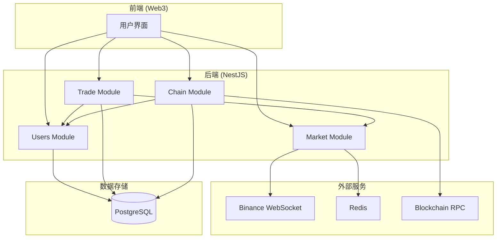
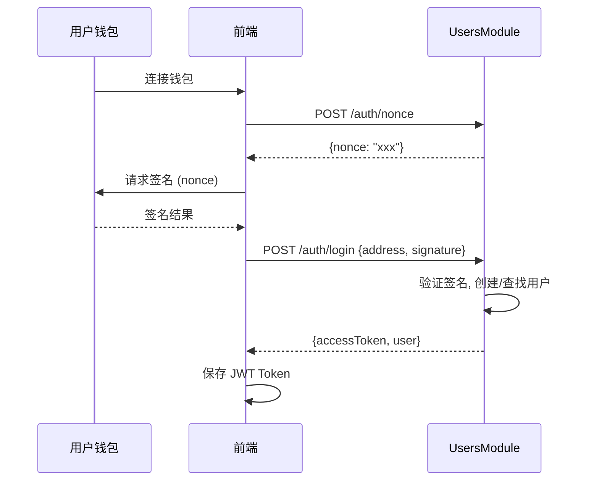
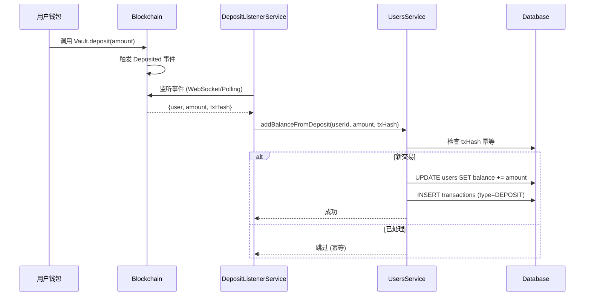
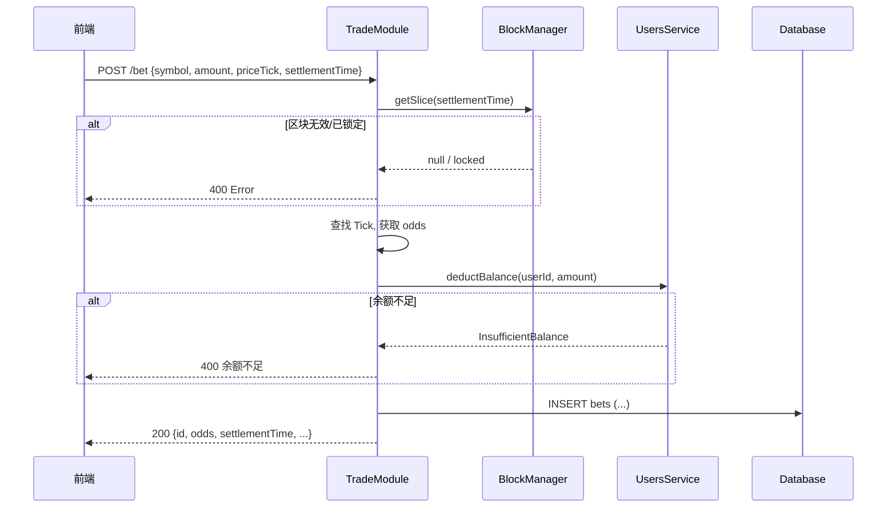
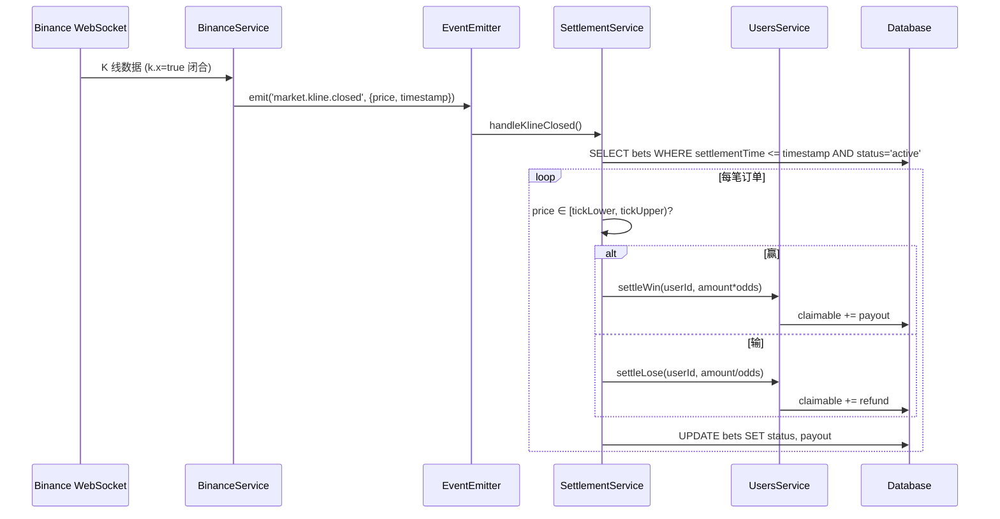
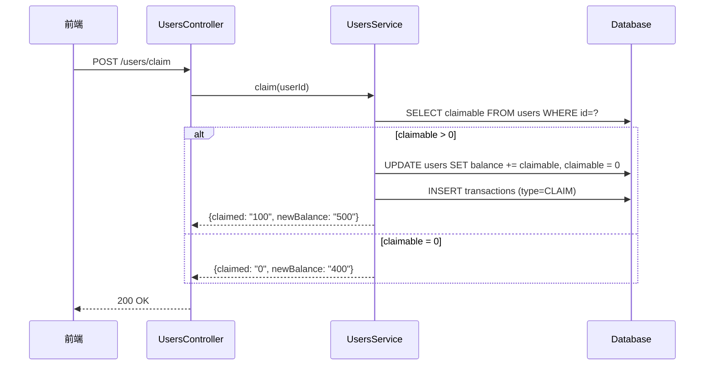
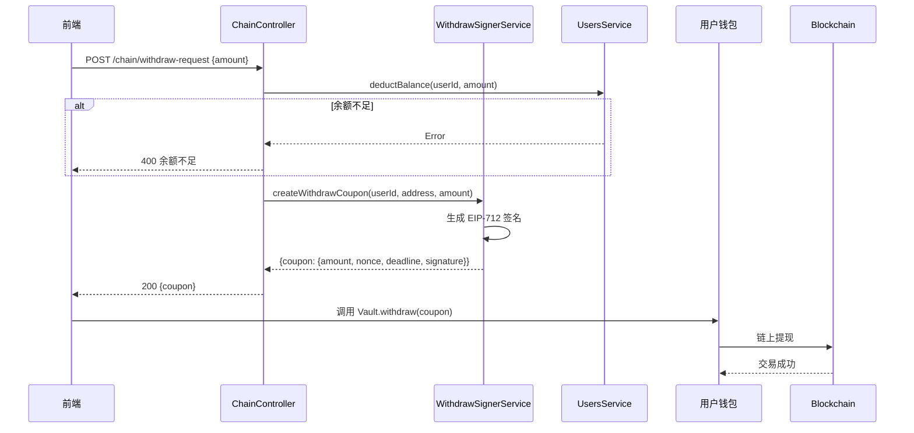
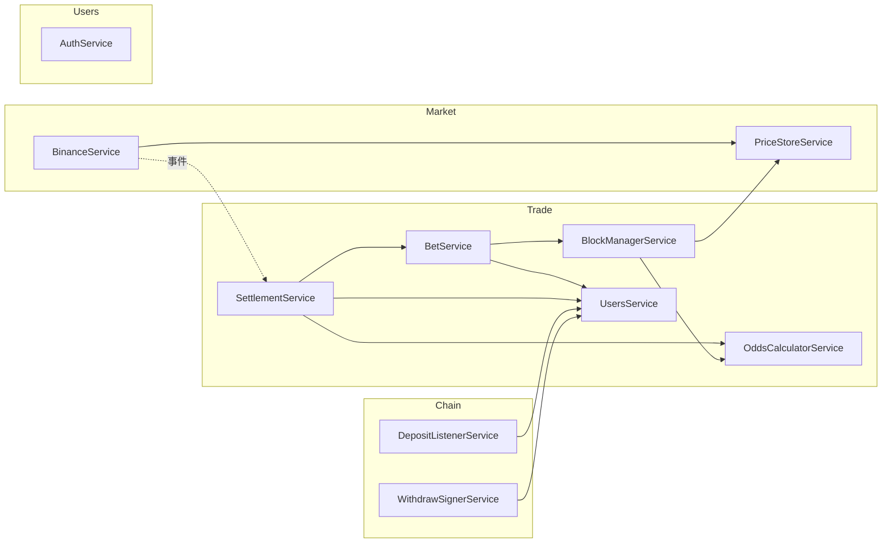

# KMarket 系统架构总览

> 版本日期: 2026-01-30

---

## 1. 模块概览



---

## 2. API 端点清单

### 2.1 Users Module (`/api/users`)

| 端点 | 方法 | 认证 | 说明 |
|------|------|:----:|------|
| `/auth/nonce` | POST | ❌ | 获取登录 Nonce |
| `/auth/login` | POST | ❌ | 钱包签名登录 |
| `/balance` | GET | ✅ | 获取余额信息 |
| `/claim` | POST | ✅ | 领取待领取余额 |
| `/balance/logs` | GET | ✅ | 查询流水记录 |

### 2.2 Chain Module (`/api/chain`)

| 端点 | 方法 | 认证 | 说明 |
|------|------|:----:|------|
| `/withdraw-request` | POST | ✅ | 请求提现凭证 |
| `/vault-balance` | GET | ✅ | 查询链上 Vault 余额 |
| `/status` | GET | ❌ | 获取链服务状态 |

### 2.3 Market Module (`/api/market`)

| 端点 | 方法 | 认证 | 说明 |
|------|------|:----:|------|
| `/price` | GET | ❌ | 获取当前价格 |
| `/kline` | GET | ❌ | 获取 K 线历史 |
| `/grid` | GET | ❌ | 获取下注网格 |

### 2.4 Trade Module (`/api/trade`)

| 端点 | 方法 | 认证 | 说明 |
|------|------|:----:|------|
| `/bet` | POST | ✅ | 下注 |
| `/positions` | GET | ✅ | 查询当前持仓 |
| `/history` | GET | ✅ | 查询历史订单 |

---

## 3. 核心业务流程

### 3.1 用户注册/登录



---

### 3.2 充值流程



---

### 3.3 下注流程



---

### 3.4 结算流程 (事件驱动)



---

### 3.5 领取流程



---

### 3.6 提现流程



---

## 4. 业务闭环验证

### 4.1 资金闭环

```
充值 → balance ↑
  ↓
下注 → balance ↓, bet(active) ↑
  ↓
结算 → bet(settled), claimable ↑
  ↓
领取 → claimable → balance ↑
  ↓
提现 → balance ↓ → 链上资产 ↑
```

### 4.2 关键不变量

| 检查项 | 公式 |
|--------|------|
| 用户资产守恒 | `balance + claimable + inBets = totalDeposited - totalWithdrawn + netProfit` |
| 结算完整性 | 所有 `settlementTime <= now` 的 `active` 订单应被结算 |
| 幂等性保证 | 同一 `txHash` 不会重复入账 |

### 4.3 已验证闭环

| 场景 | 状态 |
|------|:----:|
| 登录 → 充值 → 查余额 | ✅ |
| 查网格 → 下注 → 查持仓 | ✅ |
| K 线闭合 → 自动结算 → 领取 | ✅ |
| 请求提现签名 → 链上提现 | ✅ |

---

## 5. 服务依赖关系



---

## 6. 配置清单

| 配置项 | 环境变量 | 说明 |
|--------|----------|------|
| 数据库 | `DATABASE_URL` | PostgreSQL 连接 |
| Redis | `REDIS_URL` | K 线缓存 |
| 链 RPC | `CHAIN_RPC_URL` | 区块链节点 |
| Vault 合约 | `VAULT_ADDRESS` | 充提合约地址 |
| 服务器私钥 | `SERVER_PRIVATE_KEY` | 签名提现凭证 |
| JWT 密钥 | `JWT_SECRET` | 用户认证 |
