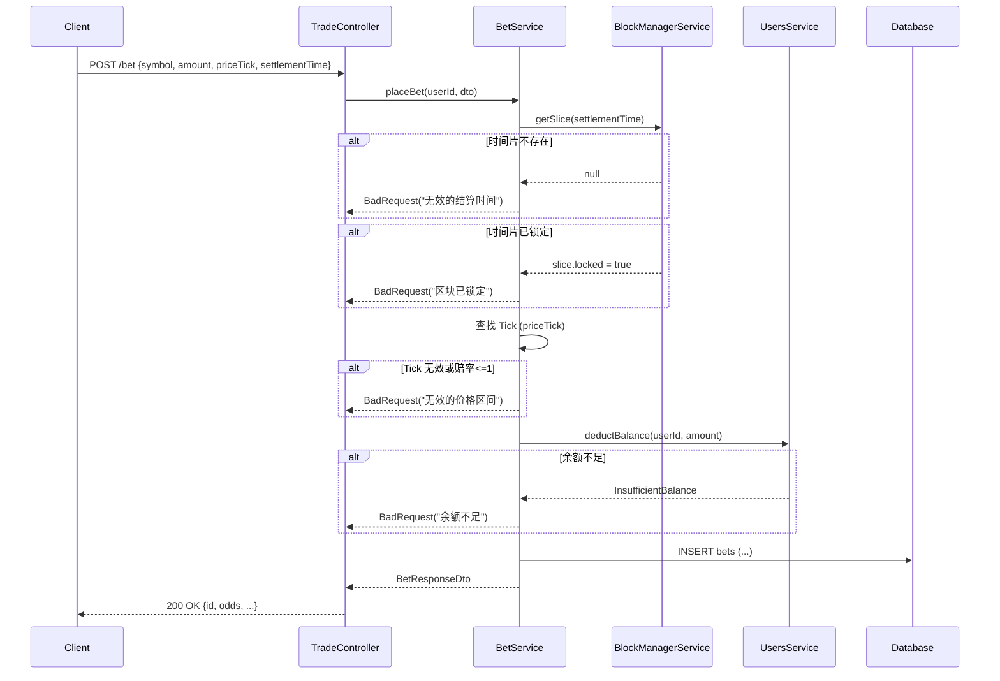
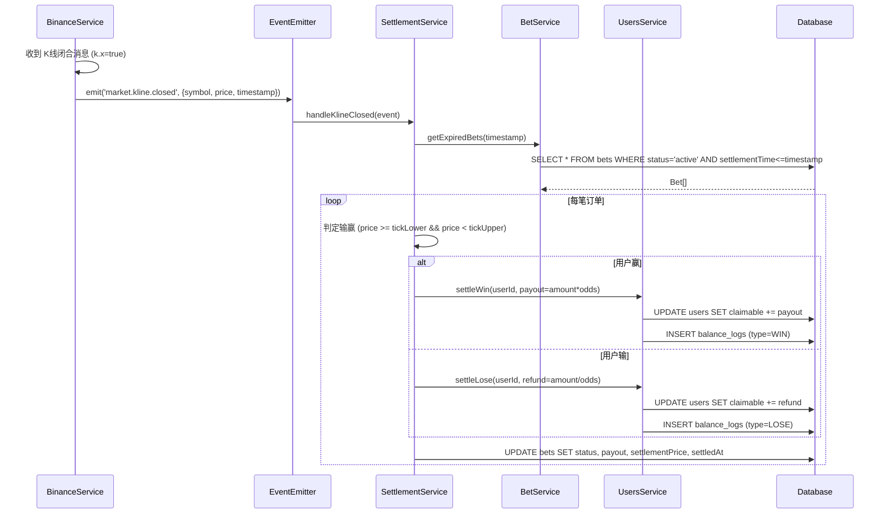
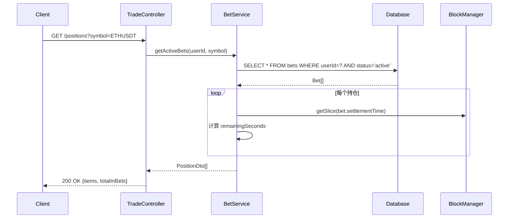
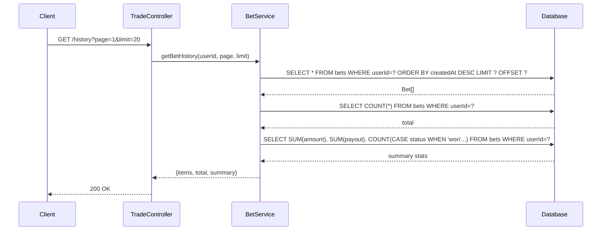

# Trade Module 实现计划

> 版本日期: 2026-01-30

---

## 1. 现状分析

### 1.1 已实现 (Pre-Existing)

| 组件 | 文件 | 状态 | 说明 |
|------|------|:----:|------|
| Bet Entity | `bet.entity.ts` | ⚠️ | 需更新字段 |
| Bet DTOs | `bet.dto.ts` | ⚠️ | 需重构匹配新流程 |
| BetService | `bet.service.ts` | ⚠️ | 需重构使用 BlockManager |
| SettlementService | `settlement.service.ts` | ✅ | 已改为事件驱动 |
| TradeController | `trade.controller.ts` | ⚠️ | 需移除签名相关逻辑 |

---

## 2. 核心业务流程

### 2.1 下注流程 (POST /api/trade/bet)



**关键步骤说明**:
1. **验证时间片**: 调用 `BlockManager.getSlice(settlementTime)` 确认区块存在且未锁定
2. **验证价格区间**: 从时间片的 ticks 数组中找到对应的 priceTick，获取 odds
3. **扣款**: 调用 `UsersService.deductBalance()` 扣减用户可用余额
4. **创建订单**: 保存下注记录，状态为 `ACTIVE`

---

### 2.2 结算流程 (事件驱动)



**关键步骤说明**:
1. **触发**: `BinanceService` 检测到 K线闭合 (`k.x=true`)，发布事件
2. **查询**: `SettlementService` 查询所有 `settlementTime <= eventTimestamp` 且 `status=ACTIVE` 的订单
3. **判定**: 比较 `settlementPrice` 与订单的 `[tickLower, tickUpper)` 区间
4. **赔付**: 
   - 赢: `claimable += amount * odds`
   - 输: `claimable += amount / odds`
5. **更新**: 订单状态变为 `WON` 或 `LOST`

---

### 2.3 持仓查询流程 (GET /api/trade/positions)



**返回数据**:
```json
{
  "items": [{
    "id": 123,
    "symbol": "ETHUSDT",
    "amount": "100",
    "priceTick": 5,
    "priceRange": {"lower": "2500.00", "upper": "2512.50"},
    "odds": "1.85",
    "settlementTime": "2026-01-30T12:00:00Z",
    "remainingSeconds": 120,
    "status": "active"
  }],
  "totalInBets": "100"
}
```

---

### 2.4 历史订单查询流程 (GET /api/trade/history)



**返回数据**:
```json
{
  "items": [...],
  "total": 100,
  "page": 1,
  "limit": 20,
  "summary": {
    "totalBets": 100,
    "wins": 45,
    "losses": 55,
    "totalWagered": "10000.00",
    "totalPayout": "9500.00",
    "netProfit": "-500.00"
  }
}
```

---

## 3. 数据变更

### 3.1 Bet Entity

| 字段 | 变更 | 说明 |
|------|------|------|
| `priceTick` | **新增** | int, 价格 Tick (-20~+20) |
| `basePrice` | **新增** | decimal, 下注时基准价 |
| `signature` | 可选化 | nullable, 保留扩展性 |
| `nonce` | 可选化 | nullable |
| `direction` | 移除 | 不再需要 |
| `expiresAt` | 重命名 | -> `settlementTime` |

### 3.2 CreateBetDto

```typescript
export class CreateBetDto {
  symbol: string;      // 交易对
  amount: string;      // 下注金额 (Wei)
  priceTick: number;   // 价格 Tick (-20~+20)
  settlementTime: number; // 结算时间戳 (ms)
}
```

---

## 4. 实施步骤

1. [x] 更新 `Bet` Entity
2. [x] 更新 DTOs (`CreateBetDto`, `BetResponseDto`)
3. [x] 重构 `BetService.placeBet()` (使用 BlockManager)
4. [x] 增强 `BetService.getActiveBets()` (返回 remainingSeconds)
5. [x] 增强 `BetService.getBetHistory()` (添加 summary 统计)
6. [x] 更新 `TradeController`
7. [x] 验证编译 `npm run build`

---

## 5. 验证计划

- 编译通过
- 调用 `POST /bet` 成功创建订单
- 等待 K 线闭合事件触发结算
- 确认 `claimable` 增加
