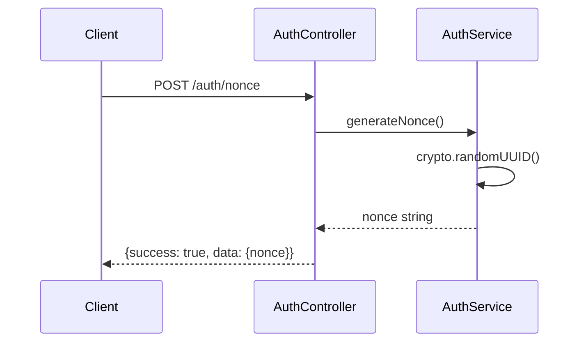
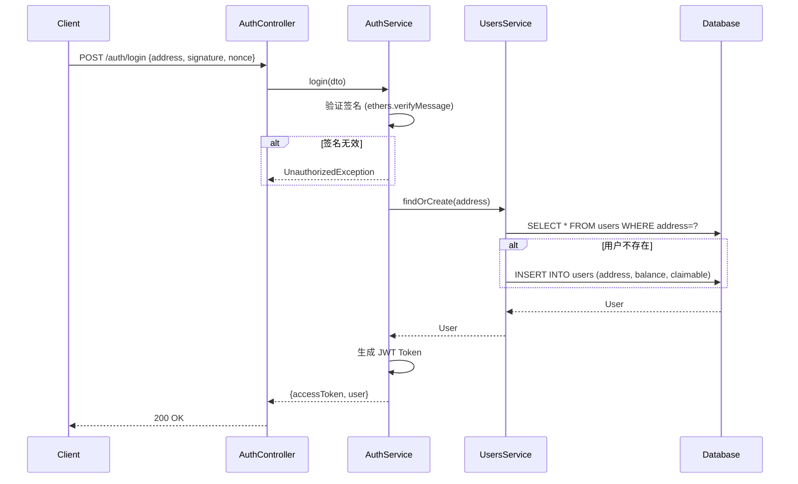
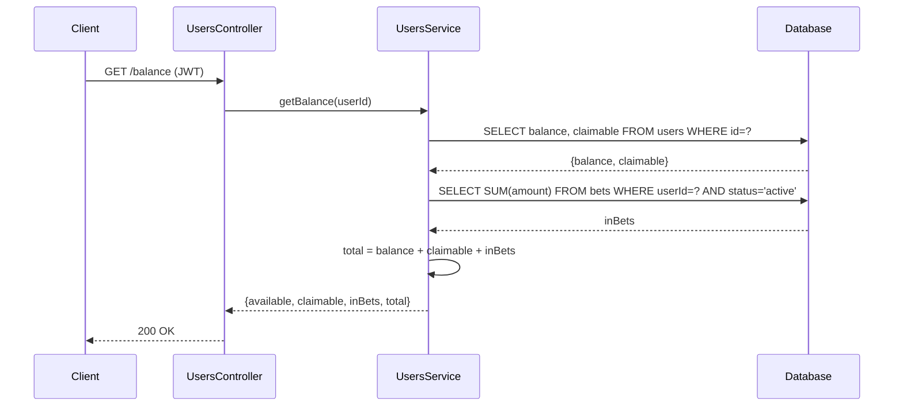
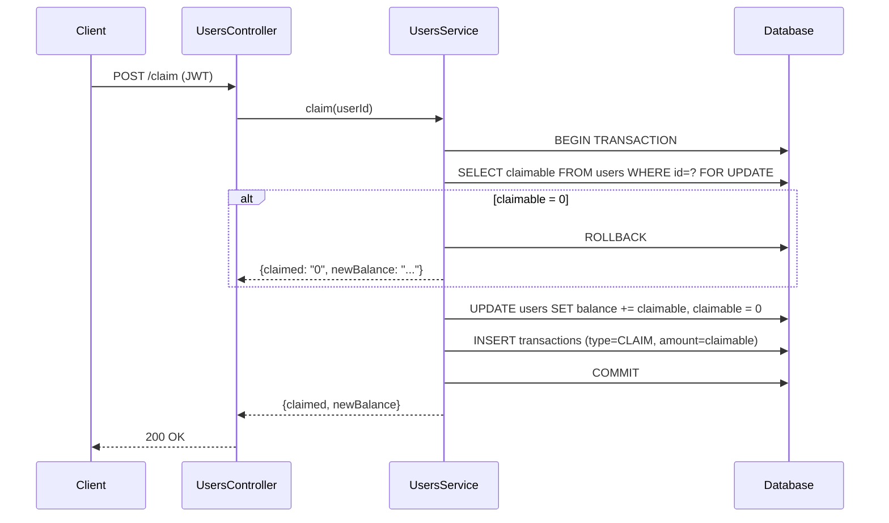
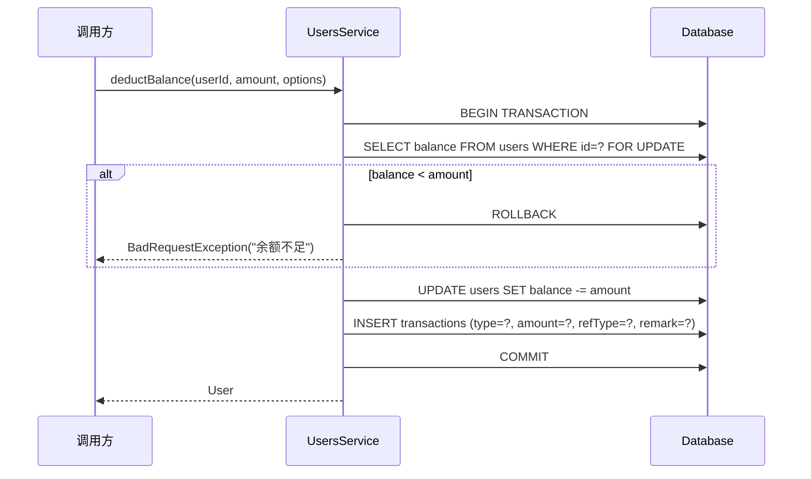
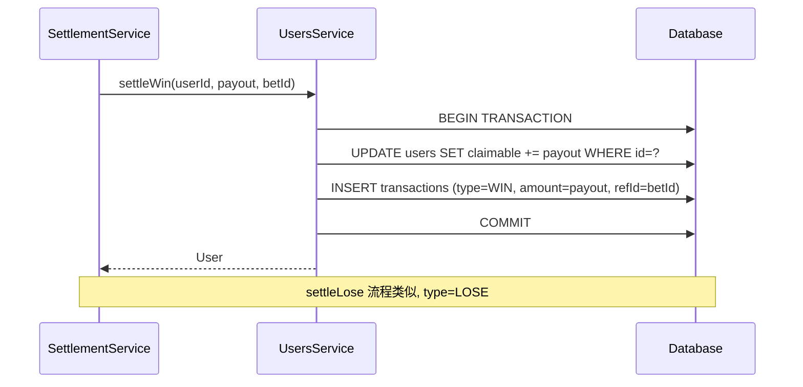
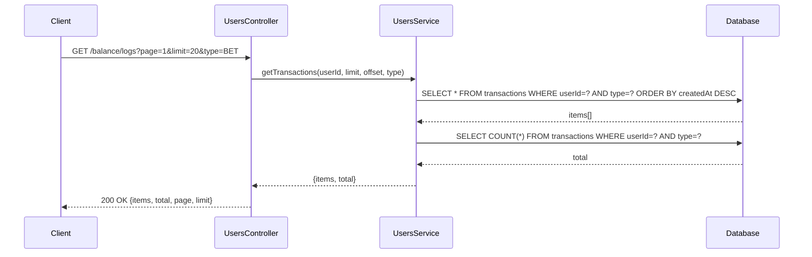

# 功能流程详解 - Users Module

> 用户服务 - 认证、余额、流水

---

## 1. 认证功能

### 1.1 获取 Nonce

**端点**: `POST /api/users/auth/nonce`



**实现**: `src/users/auth.service.ts`
```typescript
generateNonce(): string {
    return crypto.randomUUID();
}
```

---

### 1.2 钱包登录

**端点**: `POST /api/users/auth/login`



---

## 2. 余额功能

### 2.1 查询余额

**端点**: `GET /api/users/balance`



**返回结构**:
```json
{
  "available": "1000.00",
  "claimable": "50.00",
  "inBets": "200.00",
  "total": "1250.00"
}
```

---

### 2.2 领取余额

**端点**: `POST /api/users/claim`



---

### 2.3 扣减余额 (内部方法)

**调用方**: `BetService`, `WithdrawSignerService`



---

### 2.4 结算赢/输 (内部方法)

**调用方**: `SettlementService`



---

## 3. 流水功能

### 3.1 查询流水

**端点**: `GET /api/users/balance/logs`



**流水类型 (TransactionType)**:
- `DEPOSIT` - 充值
- `WITHDRAW` - 提现
- `BET` - 下注扣款
- `WIN` - 结算赢
- `LOSE` - 结算输退款
- `CLAIM` - 领取
