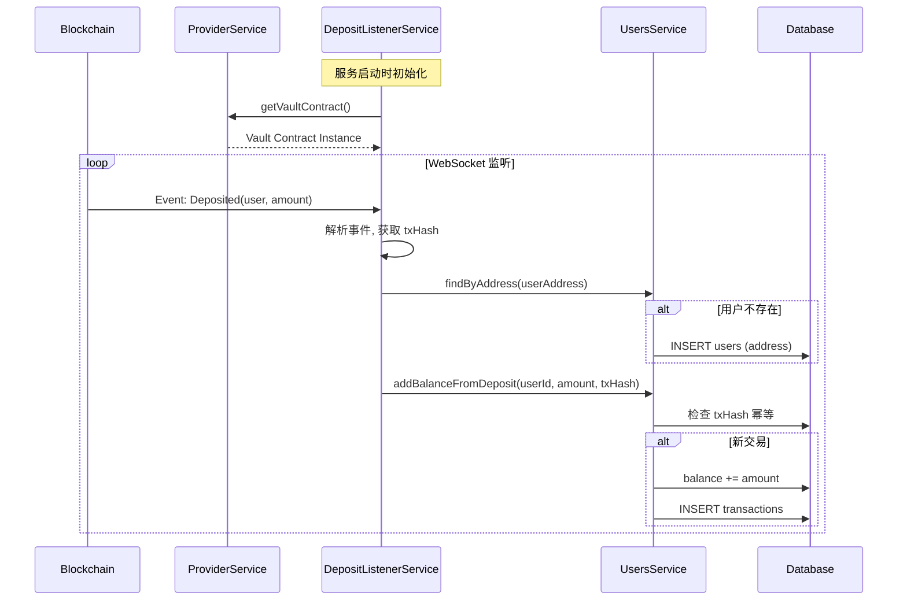
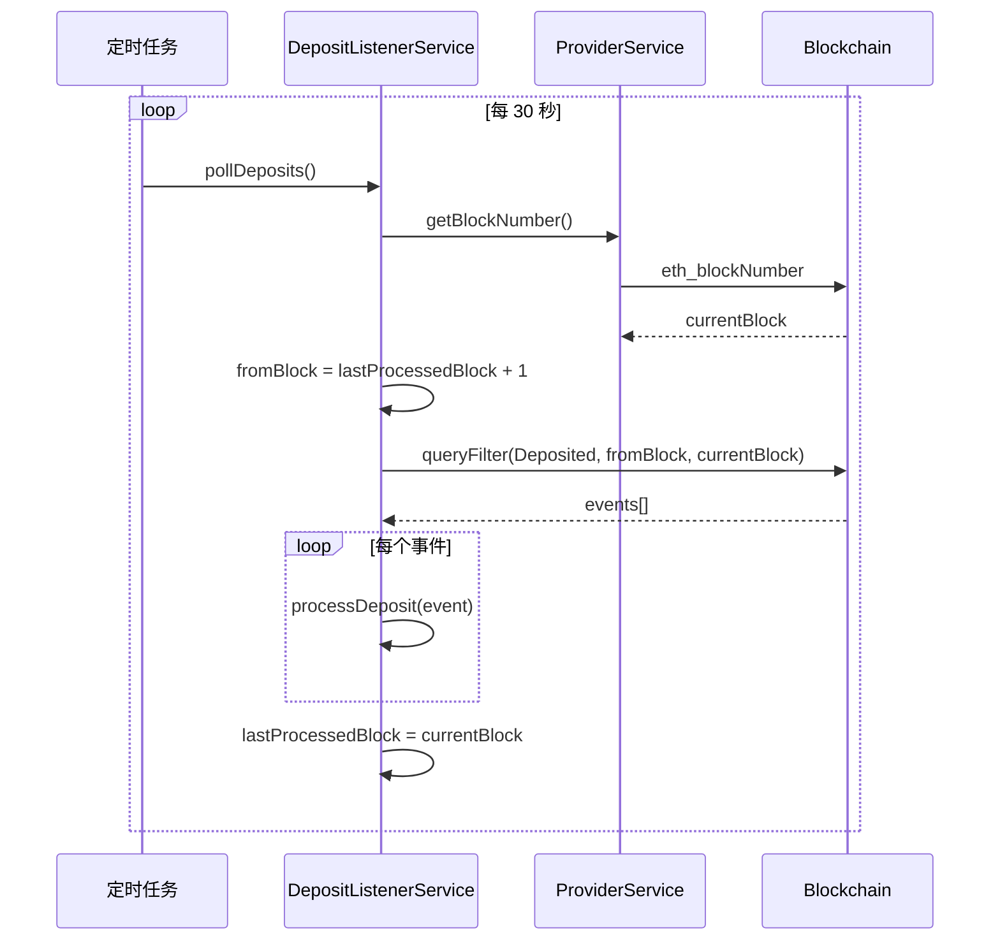
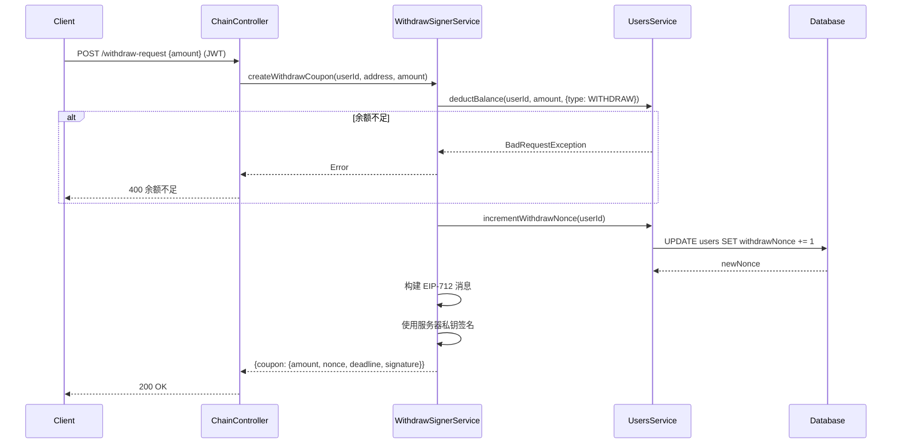
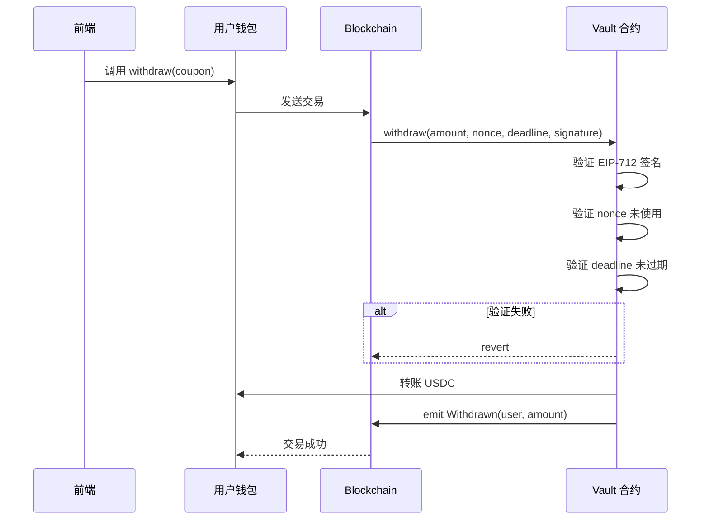
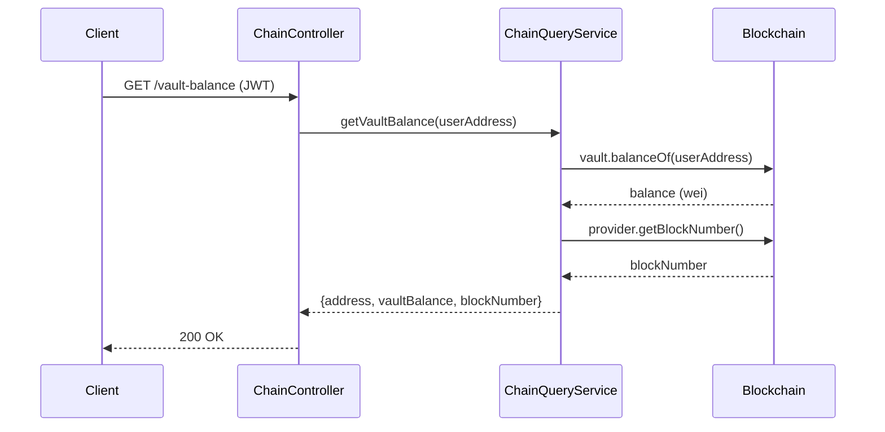
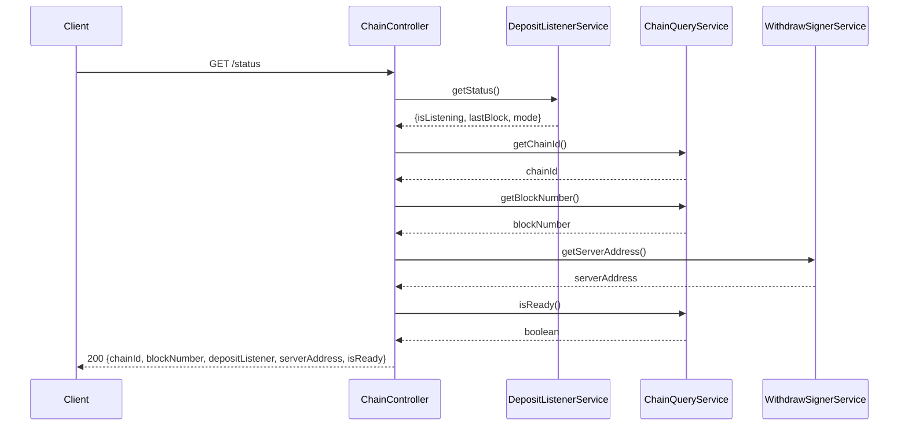

# 功能流程详解 - Chain Module

> 链服务 - 充值监听、提现签名、链上查询

---

## 1. 充值监听

### 1.1 监听链上事件

**服务**: `DepositListenerService`

### 1.2 Fallback 轮询

---

## 2. 提现签名

### 2.1 请求提现凭证

**端点**: `POST /api/chain/withdraw-request`

### 2.2 用户链上提现

---

## 3. 链上查询

### 3.1 查询 Vault 余额

**端点**: `GET /api/chain/vault-balance`

### 3.2 获取链服务状态

**端点**: `GET /api/chain/status`

