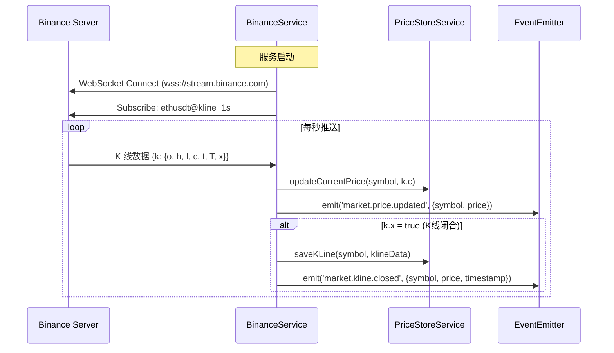
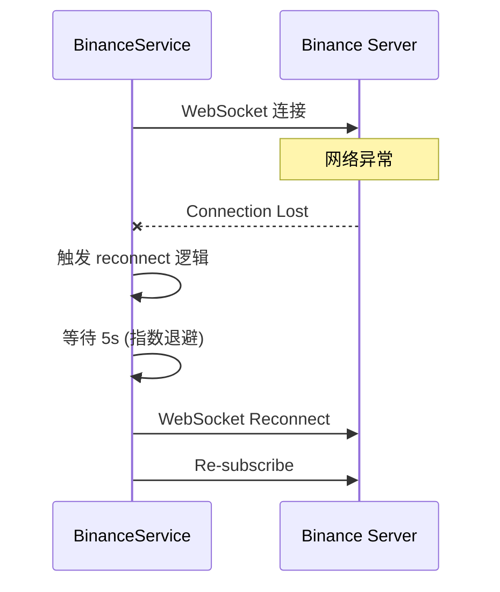
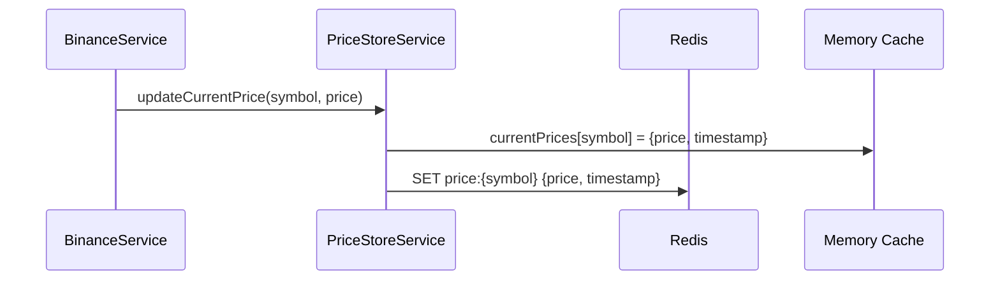
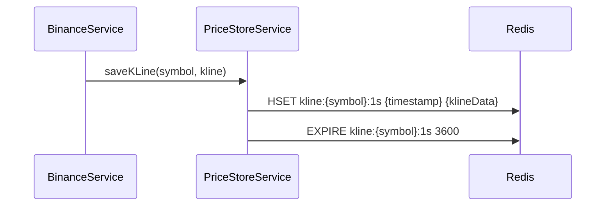
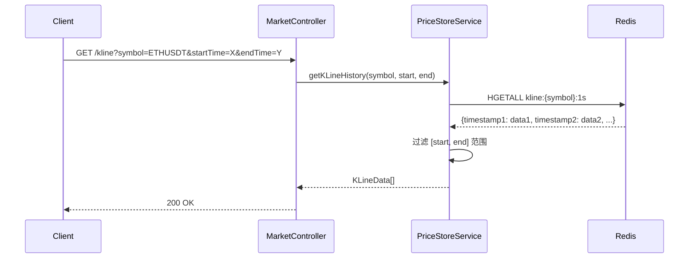
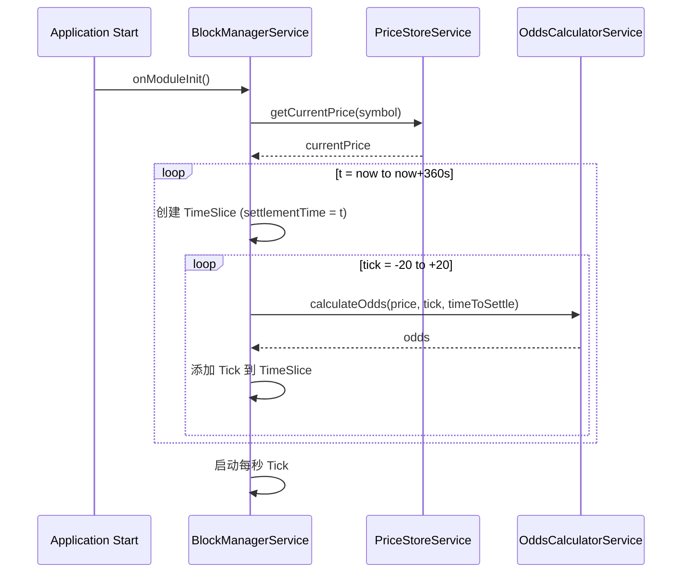
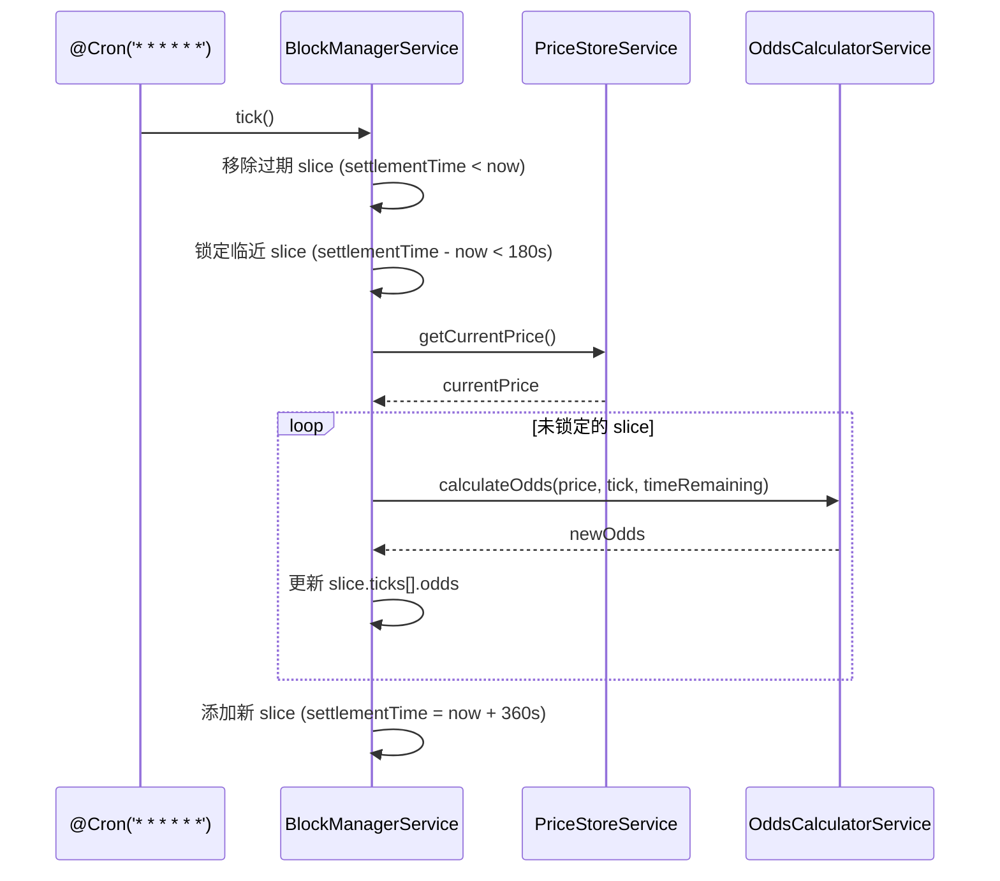
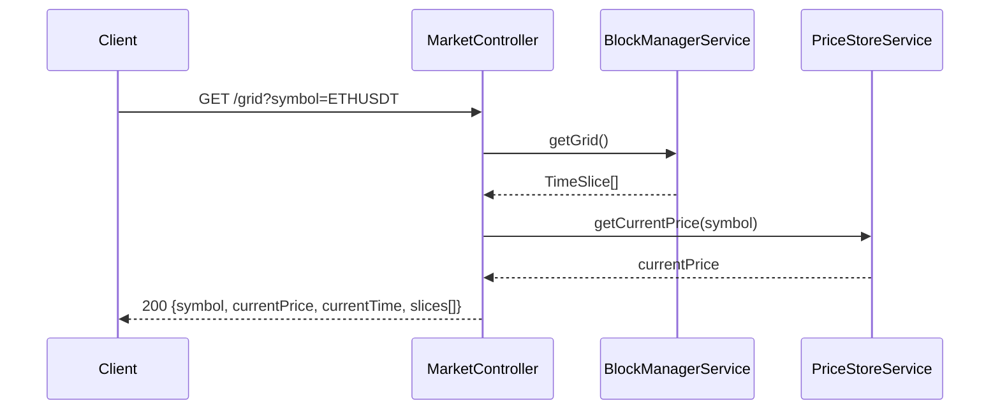

# 功能流程详解 - Market Module

> 行情服务 - K 线订阅、网格管理、赔率计算

---

## 1. K 线数据订阅

### 1.1 Binance WebSocket 连接

**服务**: `BinanceService`



### 1.2 断线重连



---

## 2. 价格存储

### 2.1 实时价格更新

**服务**: `PriceStoreService`



### 2.2 K 线历史存储



### 2.3 K 线历史查询

**端点**: `GET /api/market/kline`



---

## 3. 网格管理

### 3.1 网格初始化

**服务**: `BlockManagerService`



### 3.2 每秒 Tick (滑动窗口)



### 3.3 获取网格

**端点**: `GET /api/market/grid`



**返回结构**:
```json
{
  "symbol": "ETHUSDT",
  "currentPrice": "2500.00",
  "currentTime": 1706600000000,
  "slices": [
    {
      "id": "1706600180000",
      "settlementTime": 1706600180000,
      "basisPrice": "2500.00",
      "locked": false,
      "status": "betting",
      "ticks": [
        {"priceTick": -5, "priceRange": {"lower": "2437.50", "upper": "2450.00"}, "odds": 3.2},
        {"priceTick": 0, "priceRange": {"lower": "2487.50", "upper": "2512.50"}, "odds": 1.8}
      ]
    }
  ]
}
```

---

## 4. 赔率计算

### 4.1 计算逻辑

**服务**: `OddsCalculatorService`

```mermaid
graph TD
    A[输入: basePrice, tickIndex, timeToSettle] --> B[计算价格距离]
    B --> C[priceDistance = abs(tickIndex) * step]
    C --> D[计算时间因子]
    D --> E[timeFactor = 1 + timeDecay * timeToSettle]
    E --> F[计算原始赔率]
    F --> G[rawOdds = baseOdds + distanceBonus * priceDistance * timeFactor]
    G --> H[限制范围]
    H --> I[odds = clamp(rawOdds, minOdds, maxOdds)]
```

**公式**:
```
odds = baseOdds + (distanceBonus × |tickIndex| × step) × timeFactor
timeFactor = 1 + timeDecay × timeToSettle

约束: minOdds (1.1) <= odds <= maxOdds (20.0)
```

### 4.2 赔付计算

```typescript
// 赢
payout = amount × odds

// 输
refund = amount / odds
```
