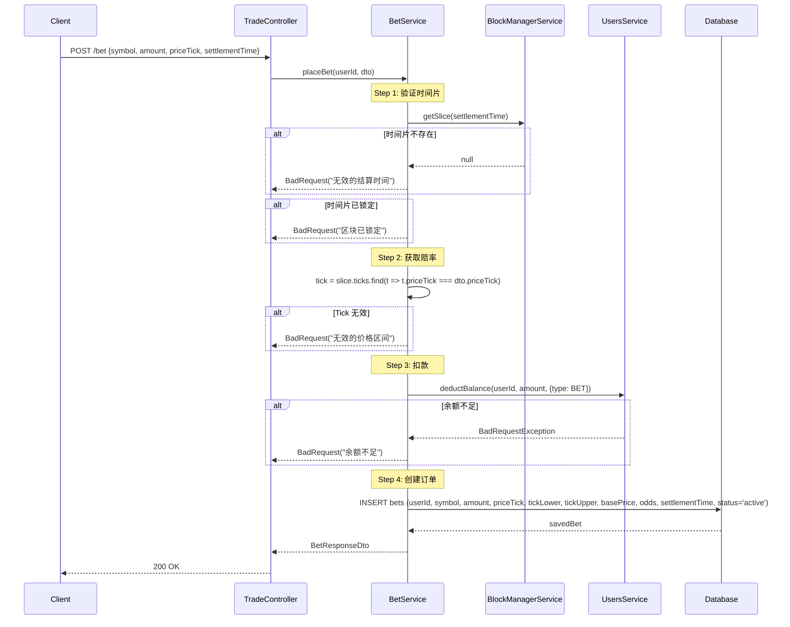
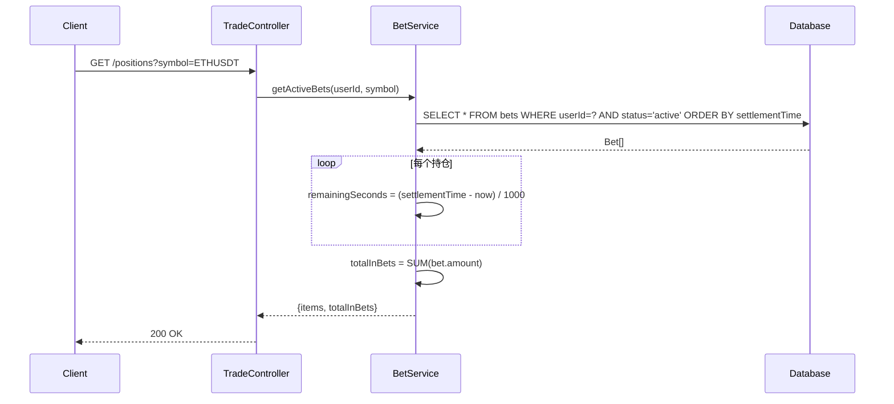
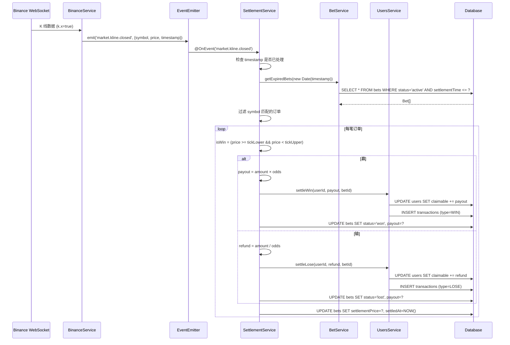
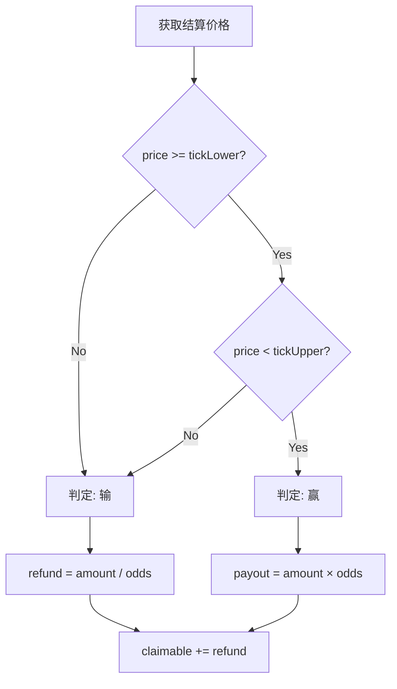
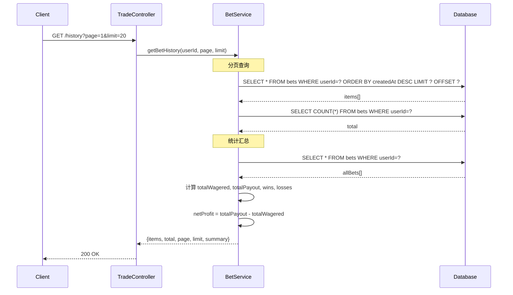
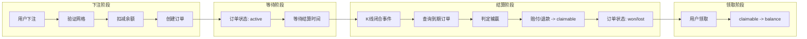

# 功能流程详解 - Trade Module

> 交易服务 - 下注、持仓、结算、历史

---

## 1. 下注功能

### 1.1 下注接口

**端点**: `POST /api/trade/bet`



**请求体**:
```json
{
  "symbol": "ETHUSDT",
  "amount": "100.000000000000000000",
  "priceTick": 5,
  "settlementTime": 1706600180000
}
```

**响应体**:
```json
{
  "id": 12345,
  "symbol": "ETHUSDT",
  "amount": "100.000000000000000000",
  "priceTick": 5,
  "priceRange": {"lower": "2525.00", "upper": "2537.50"},
  "basePrice": "2500.00",
  "odds": "2.35",
  "settlementTime": "2026-01-30T12:03:00Z",
  "status": "active",
  "createdAt": "2026-01-30T12:00:00Z"
}
```

---

## 2. 持仓查询

### 2.1 查询当前持仓

**端点**: `GET /api/trade/positions`



**响应体**:
```json
{
  "items": [
    {
      "id": 12345,
      "symbol": "ETHUSDT",
      "amount": "100",
      "priceTick": 5,
      "priceRange": {"lower": "2525.00", "upper": "2537.50"},
      "odds": "2.35",
      "settlementTime": "2026-01-30T12:03:00Z",
      "remainingSeconds": 120,
      "status": "active"
    }
  ],
  "totalInBets": "100"
}
```

---

## 3. 结算功能

### 3.1 事件驱动结算

**服务**: `SettlementService`



### 3.2 判定逻辑



---

## 4. 历史查询

### 4.1 查询历史订单

**端点**: `GET /api/trade/history`



**响应体**:
```json
{
  "items": [...],
  "total": 100,
  "page": 1,
  "limit": 20,
  "summary": {
    "totalBets": 100,
    "wins": 45,
    "losses": 55,
    "totalWagered": "10000.00",
    "totalPayout": "9500.00",
    "netProfit": "-500.00"
  }
}
```

---

## 5. 数据流总结


