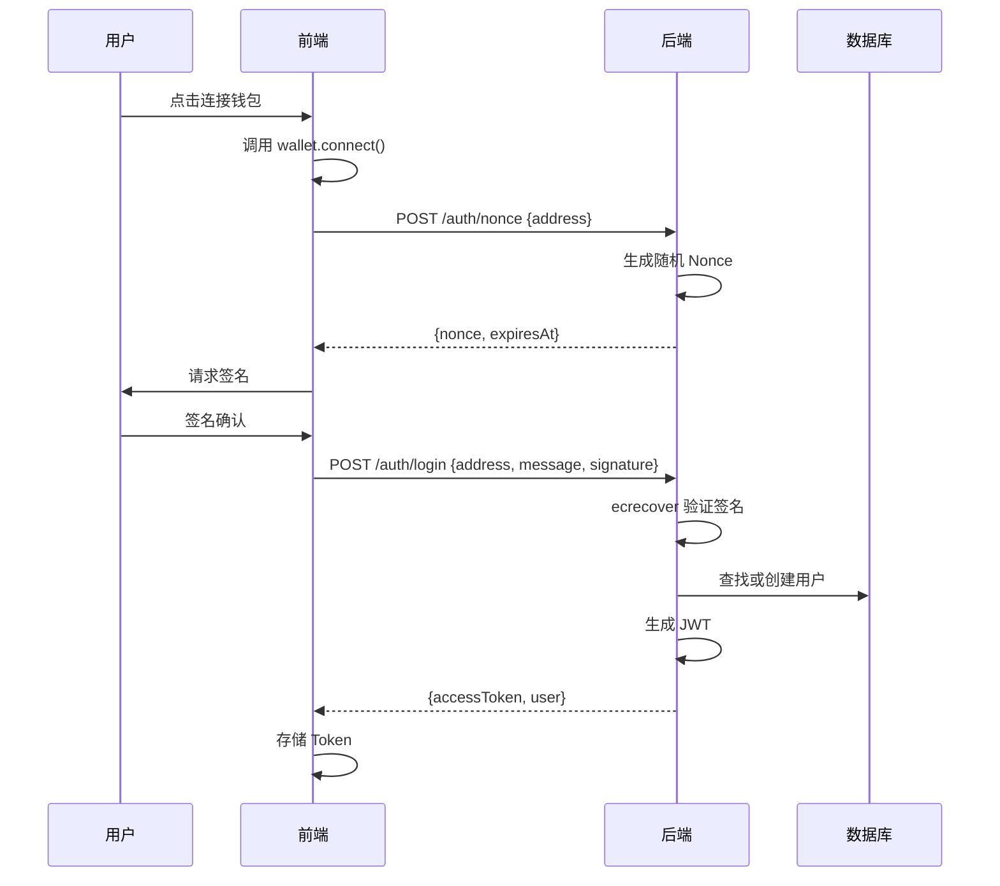
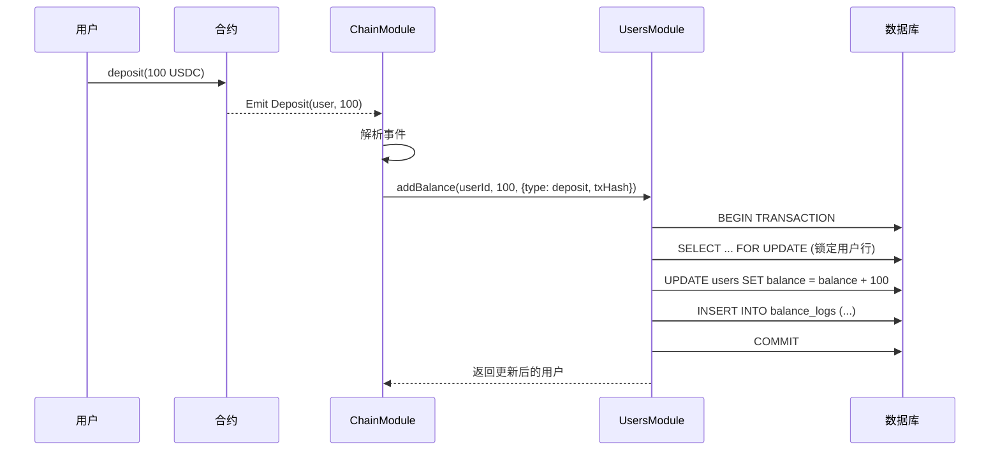
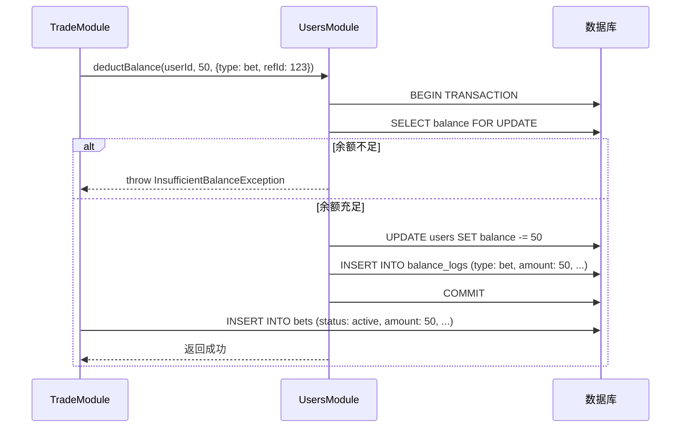
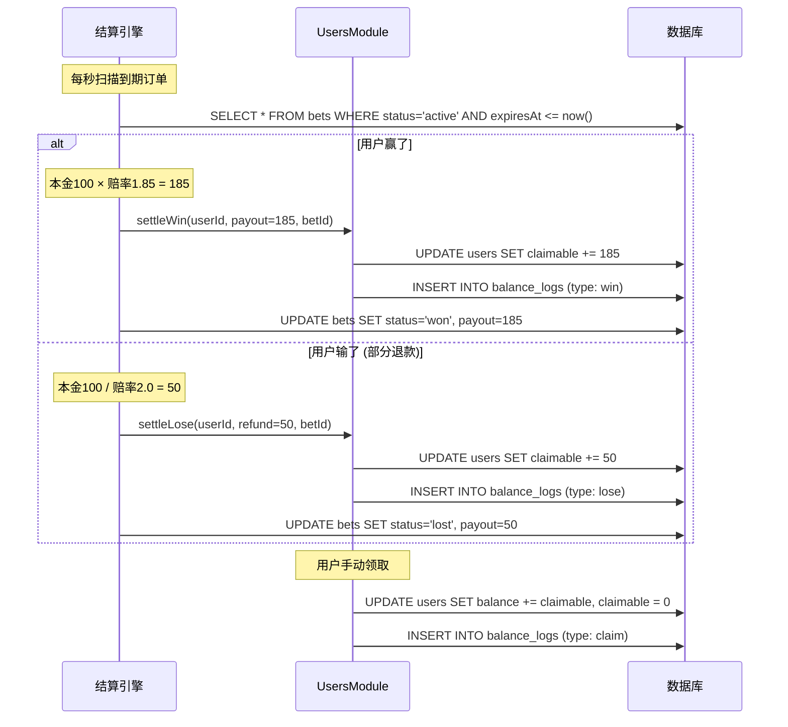

# 账户模块设计文档

> Users Module - 用户认证与余额管理

---

## 1. 模块概述

### 1.1 核心职责

| 功能 | 说明 |
|------|------|
| **钱包认证** | 连接钱包、签名验证、JWT 登录 |
| **余额查询** | 链上质押余额 + 数据库可用余额 |
| **余额操作** | 为其他模块提供余额增减接口 |
| **流水记录** | 所有余额变动自动记录 |

### 1.2 模块依赖关系

```
┌─────────────────────────────────────────────────────────┐
│                    External Calls                        │
│  ChainModule ──────┐       ┌────── TradeModule          │
│                    ▼       ▼                             │
│              ┌─────────────────┐                        │
│              │   UsersModule   │                        │
│              │                 │                        │
│              │ • addBalance()  │◄── ChainModule 充值    │
│              │ • deductBalance()│◄── TradeModule 下注   │
│              │ • settleWin()   │◄── TradeModule 结算    │
│              └─────────────────┘                        │
└─────────────────────────────────────────────────────────┘
```

---

## 2. 数据库设计

### 2.1 设计原则

> **简化余额模型**: 用户表只存储单一 `balance` 字段，"在押资金" 通过 `bets` 表实时聚合计算，避免冻结/解冻操作带来的并发一致性问题。

### 2.2 表结构总览

```
┌───────────────┐      ┌───────────────────┐
│    users      │      │   balance_logs    │
├───────────────┤      ├───────────────────┤
│ id            │──┐   │ id                │
│ address       │  │   │ userId        FK  │◄──┘
│ balance       │  │   │ type              │
│ claimable     │  │   │ amount            │
│ withdrawNonce │  │   │ balanceBefore     │
│ createdAt     │  └──▶│ balanceAfter      │
│ updatedAt     │      │ refType           │
└───────────────┘      │ refId             │
                       │ txHash            │
                       │ remark            │
                       │ createdAt         │
                       └───────────────────┘
```

### 2.3 users 表 (用户账户)

| 字段 | 类型 | 约束 | 说明 |
|------|------|------|------|
| `id` | int | PK, Auto | 用户ID |
| `address` | varchar(42) | Unique, Index | 钱包地址 (小写) |
| `balance` | decimal(36,18) | Default '0' | 可用余额 (可下注/可提现) |
| `claimable` | decimal(36,18) | Default '0' | **待领取余额** (结算赔付进入这里) |
| `withdrawNonce` | int | Default 0 | 提现计数器 (防重放) |
| `isActive` | boolean | Default true | 账户状态 |
| `createdAt` | timestamp | Auto | 创建时间 |
| `updatedAt` | timestamp | Auto | 更新时间 |

> ⚠️ **注意**: 
> - 不再使用 `frozenBalance` 字段，在押资金通过 `bets` 表聚合计算
> - 结算赔付先进入 `claimable`，用户手动领取后转入 `balance`

**索引**:
- `idx_users_address` (address) - 唯一索引

---

### 2.4 balance_logs 表 (余额流水)

| 字段 | 类型 | 约束 | 说明 |
|------|------|------|------|
| `id` | bigint | PK, Auto | 流水ID |
| `userId` | int | FK, Index | 用户ID |
| `type` | enum | Not Null | 变动类型 |
| `amount` | decimal(36,18) | Not Null | 变动金额 (正数) |
| `balanceBefore` | decimal(36,18) | Not Null | 变动前余额 |
| `balanceAfter` | decimal(36,18) | Not Null | 变动后余额 |
| `refType` | varchar(20) | Nullable | 关联业务类型 |
| `refId` | varchar(100) | Nullable | 关联业务ID |
| `txHash` | varchar(66) | Nullable | 链上交易哈希 |
| `remark` | varchar(255) | Nullable | 备注 |
| `createdAt` | timestamp | Auto, Index | 创建时间 |

**type 枚举值**:

| 值 | 说明 | 余额影响 |
|------|------|----------|
| `deposit` | 充值 (链上同步) | balance +amount |
| `withdraw` | 提现申请 | balance -amount |
| `bet` | 下注扣款 | balance -amount |
| `win` | 结算赢 | claimable +payout |
| `lose` | 结算输退款 | claimable +refund |
| `claim` | 领取待领取余额 | claimable → balance |
| `refund` | 订单取消退款 | balance +amount |
| `admin_adjust` | 管理员调整 | ±amount |

**refType 关联类型**:

| 值 | refId 示例 | 说明 |
|------|-----------|------|
| `chain_deposit` | `0x123...abc` | 链上充值 txHash |
| `chain_withdraw` | `coupon_123` | 提现 Coupon ID |
| `bet` | `123` | 下注订单 ID |
| `admin` | `admin_user_1` | 管理员操作 ID |

**索引**:
- `idx_balance_logs_user_time` (userId, createdAt DESC)
- `idx_balance_logs_type` (type)
- `idx_balance_logs_ref` (refType, refId)

---

## 3. API 设计

### 3.1 对外 REST API

#### 3.1.1 获取登录 Nonce

```
POST /api/users/auth/nonce
```

**Request**:
```json
{
  "address": "0x1234...abcd"
}
```

**Response**:
```json
{
  "success": true,
  "data": {
    "nonce": "Sign this message to login KMarket: 1706457600-abc123",
    "expiresAt": 1706458200
  }
}
```

---

#### 3.1.2 钱包签名登录

```
POST /api/users/auth/login
```

**Request**:
```json
{
  "address": "0x1234...abcd",
  "message": "Sign this message to login KMarket: 1706457600-abc123",
  "signature": "0x..."
}
```

**Response**:
```json
{
  "success": true,
  "data": {
    "accessToken": "eyJhbGciOiJIUzI1...",
    "expiresIn": 604800,
    "user": {
      "id": 1,
      "address": "0x1234...abcd"
    }
  }
}
```

---

#### 3.1.3 获取余额

```
GET /api/users/balance
Authorization: Bearer <token>
```

**Response**:
```json
{
  "success": true,
  "data": {
    "available": "1000.000000000000000000",
    "claimable": "150.000000000000000000",
    "inBets": "50.000000000000000000",
    "total": "1200.000000000000000000"
  }
}
```

**字段说明**:
| 字段 | 说明 |
|------|------|
| `available` | 可用余额 (可下注/可提现) |
| `claimable` | 待领取余额 (结算赔付，需手动领取) |
| `inBets` | 在押资金 (从活跃订单聚合) |
| `total` | 总资产 = available + claimable + inBets |

---

#### 3.1.5 领取待领取余额

```
POST /api/users/claim
Authorization: Bearer <token>
```

**Response**:
```json
{
  "success": true,
  "data": {
    "claimed": "150.000000000000000000",
    "newBalance": "1150.000000000000000000"
  }
}
```

**业务逻辑**:
```
1. 检查 claimable > 0
2. balance += claimable
3. claimable = 0
4. 记录流水 (type: claim)
```

---

#### 3.1.4 获取余额流水

```
GET /api/users/balance/logs?page=1&limit=20&type=deposit
Authorization: Bearer <token>
```

**Response**:
```json
{
  "success": true,
  "data": {
    "items": [
      {
        "id": 1,
        "type": "deposit",
        "amount": "100.000000",
        "balanceBefore": "0.000000",
        "balanceAfter": "100.000000",
        "txHash": "0xabc...",
        "createdAt": "2024-01-28T10:00:00Z"
      }
    ],
    "total": 50,
    "page": 1,
    "limit": 20
  }
}
```

---

### 3.2 内部接口 (供其他模块调用)

> 这些方法由 `UsersService` 导出，其他模块通过依赖注入调用

#### 3.2.1 增加余额 (充值)

```typescript
/**
 * 增加用户余额 (用于充值)
 * @param userId 用户ID
 * @param amount 金额 (字符串，保持精度)
 * @param options 选项
 */
async addBalance(
  userId: number,
  amount: string,
  options: {
    type: BalanceLogType;
    refType?: string;
    refId?: string;
    txHash?: string;
    remark?: string;
  }
): Promise<User>
```

**调用示例 (ChainModule)**:
```typescript
await this.usersService.addBalance(user.id, '100.5', {
  type: BalanceLogType.DEPOSIT,
  refType: 'chain_deposit',
  refId: event.transactionHash,
  txHash: event.transactionHash,
  remark: `Block #${event.blockNumber}`,
});
```

---

#### 3.2.2 扣减余额

```typescript
/**
 * 扣减用户余额
 * @throws InsufficientBalanceException 余额不足时抛出
 */
async deductBalance(
  userId: number,
  amount: string,
  options: {
    type: BalanceLogType;
    refType?: string;
    refId?: string;
    remark?: string;
  }
): Promise<User>
```

---

#### 3.2.3 结算赢 (加入待领取余额)

```typescript
/**
 * 结算下注 - 赢
 * 赔付加入待领取余额 claimable (本金 × 赔率)
 */
async settleWin(
  userId: number,
  payout: string,  // 本金 × 赔率
  betId: number
): Promise<User>
```

**调用示例**:
```typescript
// 用户下注 100，赔率 1.85，赢了获得 185 (进入 claimable)
await this.usersService.settleWin(user.id, '185', betId);
```

> **注意**: 赔付进入 `claimable` 而非 `balance`，用户需手动领取

---

#### 3.2.4 结算输 (部分退款到待领取)

```typescript
/**
 * 结算下注 - 输
 * 退款加入待领取余额 claimable (本金 / 赔率)
 * @param refundAmount 退还金额 (可为 0 表示全亏)
 */
async settleLose(
  userId: number,
  refundAmount: string,
  betId: number
): Promise<User>
```

**调用示例**:
```typescript
// 用户下注 100，赔率 2.0，输了退还 50 (进入 claimable)
await this.usersService.settleLose(user.id, '50', betId);
```

> **注意**: 退款进入 `claimable` 而非 `balance`，用户需手动领取
> 如果 refundAmount = 0，则表示全亏，不产生流水记录

---

#### 3.2.5 领取待领取余额

```typescript
/**
 * 领取待领取余额到可用余额
 * claimable 全额转入 balance
 */
async claim(userId: number): Promise<{ claimed: string; newBalance: string }>
```

---

#### 3.2.5 获取在押资金 (查询)

```typescript
/**
 * 获取用户当前在押资金
 * 从 bets 表聚合活跃订单金额
 */
async getInBetsAmount(userId: number): Promise<string>
```

---

## 4. 核心流程

### 4.1 登录流程



### 4.2 充值同步流程



### 4.3 下注扣款流程 (简化版)



### 4.4 结算流程



---

## 5. 实现要点

### 5.1 事务与锁

所有余额操作必须使用 **事务 + 悲观锁**：

```typescript
async addBalance(...) {
  return this.dataSource.transaction(async (manager) => {
    // 1. 锁定用户行
    const user = await manager.findOne(User, {
      where: { id: userId },
      lock: { mode: 'pessimistic_write' },
    });
    
    // 2. 更新余额
    const balanceBefore = user.balance;
    user.balance = (BigInt(user.balance) + BigInt(amount)).toString();
    
    // 3. 记录流水
    const log = manager.create(BalanceLog, {
      userId,
      type,
      amount,
      balanceBefore,
      balanceAfter: user.balance,
      ...options,
    });
    
    // 4. 保存
    await manager.save([user, log]);
    return user;
  });
}
```

### 5.2 金额精度

使用字符串存储，避免浮点数精度丢失：

```typescript
// ✅ 正确
user.balance = (BigInt(user.balance) + BigInt(amount)).toString();

// ❌ 错误
user.balance = parseFloat(user.balance) + parseFloat(amount);
```

### 5.3 幂等性

充值操作需要检查 txHash 是否已处理：

```typescript
async addBalanceFromDeposit(userId: number, amount: string, txHash: string) {
  // 检查是否已处理
  const existing = await this.balanceLogRepo.findOne({
    where: { txHash }
  });
  if (existing) {
    return; // 已处理，跳过
  }
  
  // 正常处理...
}
```

---

## 6. 文件结构

```
src/users/
├── entities/
│   ├── user.entity.ts
│   ├── balance-log.entity.ts
│   └── index.ts
├── dto/
│   ├── auth.dto.ts
│   ├── balance.dto.ts
│   └── index.ts
├── users.controller.ts
├── users.service.ts
├── auth.service.ts
├── jwt.strategy.ts
└── users.module.ts
```
