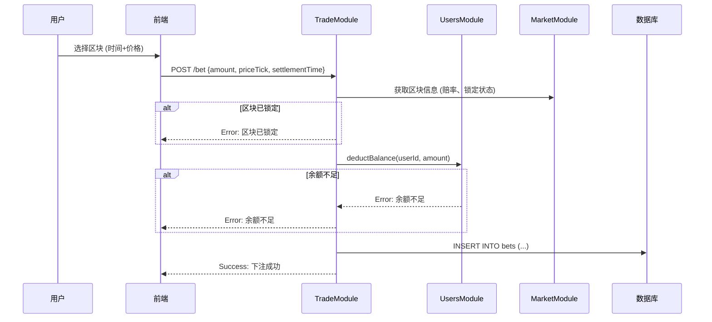
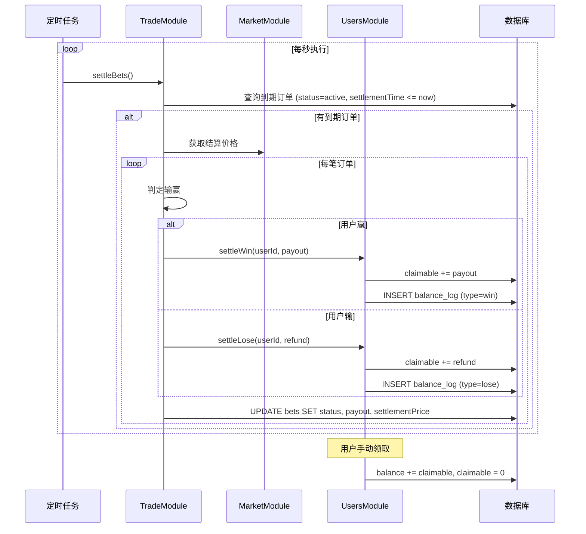

# Trade 模块设计文档

> Trade Module - 下注与结算

---

## 1. 模块概述

### 1.1 核心职责

| 功能 | 说明 |
|------|------|
| **下注处理** | 验证签名、检查余额、扣款、创建订单 |
| **订单管理** | 存储和查询用户下注记录 |
| **结算引擎** | 定时扫描到期订单，判定输赢，执行赔付 |
| **赔付计算** | 赢返本金×赔率，输退本金/赔率 |

### 1.2 模块依赖

```
┌─────────────────────────────────────────────────────────┐
│                     TradeModule                          │
│                                                          │
│  ┌─────────────┐  ┌─────────────┐  ┌─────────────┐     │
│  │  Bet API    │  │  Settlement │  │   History   │     │
│  │  下注接口   │  │  结算引擎   │  │   历史查询   │     │
│  └──────┬──────┘  └──────┬──────┘  └──────┬──────┘     │
│         │                │                │             │
│         ▼                ▼                ▼             │
│  ┌─────────────────────────────────────────────────┐   │
│  │                   依赖模块                        │   │
│  │  UsersModule (余额操作)                          │   │
│  │  MarketModule (赔率查询、结算价格)                │   │
│  └─────────────────────────────────────────────────┘   │
└─────────────────────────────────────────────────────────┘
```

---

## 2. 数据库设计

### 2.1 bets 表 (下注订单)

| 字段 | 类型 | 约束 | 说明 |
|------|------|------|------|
| `id` | bigint | PK, Auto | 订单ID |
| `userId` | int | FK, Index | 用户ID |
| `symbol` | varchar(20) | Index | 交易对 (ETHUSDT) |
| `amount` | decimal(36,18) | Not Null | 下注金额 |
| `priceTick` | int | Not Null | 价格 Tick (-20 ~ +20) |
| `tickLower` | decimal(36,18) | Not Null | 价格区间下限 |
| `tickUpper` | decimal(36,18) | Not Null | 价格区间上限 |
| `basePrice` | decimal(36,18) | Not Null | 下注时基准价格 |
| `odds` | decimal(10,4) | Not Null | 锁定的赔率 |
| `settlementTime` | timestamp | Index | 结算时间 |
| `settlementPrice` | decimal(36,18) | Nullable | 结算价格 |
| `status` | enum | Index | 状态 |
| `payout` | decimal(36,18) | Nullable | 实际赔付金额 |
| `createdAt` | timestamp | Auto | 下注时间 |
| `settledAt` | timestamp | Nullable | 结算时间 |

> **注意**: 移除了 `signature` 和 `nonce` 字段，下注暂不需要签名

**status 枚举值**:

| 值 | 说明 |
|------|------|
| `active` | 进行中，等待结算 |
| `won` | 已结算，用户赢 |
| `lost` | 已结算，用户输 |
| `cancelled` | 已取消 |

**索引**:
- `idx_bets_user` (userId, createdAt DESC)
- `idx_bets_settlement` (status, settlementTime) - 用于结算扫描
- `idx_bets_symbol` (symbol, settlementTime)

---

## 3. 下注流程

### 3.1 流程图



> **注意**: 下注暂不需要签名验证，后续可扩展授权签名模式

### 3.2 下注验证逻辑

```typescript
async placeBet(dto: CreateBetDto, userId: number): Promise<Bet> {
  // 1. 验证区块状态
  const timeSlice = await this.marketService.getTimeSlice(dto.symbol, dto.settlementTime);
  if (!timeSlice) {
    throw new BadRequestException('无效的结算时间');
  }
  if (timeSlice.locked) {
    throw new BadRequestException('区块已锁定，不可下注');
  }
  
  // 2. 获取赔率
  const tick = timeSlice.ticks.find(t => t.priceTick === dto.priceTick);
  if (!tick) {
    throw new BadRequestException('无效的价格区间');
  }
  const odds = tick.odds;
  
  // 3. 扣减余额
  await this.usersService.deductBalance(userId, dto.amount, {
    type: BalanceLogType.BET,
    refType: 'bet',
    refId: '', // 稍后填充
  });
  
  // 4. 创建订单
  const bet = this.betRepo.create({
    userId,
    symbol: dto.symbol,
    amount: dto.amount,
    priceTick: dto.priceTick,
    tickLower: tick.priceRange.lower,
    tickUpper: tick.priceRange.upper,
    basePrice: timeSlice.basePrice,
    odds,
    settlementTime: new Date(dto.settlementTime),
    status: BetStatus.ACTIVE,
  });
  
  await this.betRepo.save(bet);
  
  // 5. 更新流水的 refId
  await this.usersService.updateBalanceLogRefId(userId, 'bet', bet.id.toString());
  
  return bet;
}
```

---

## 4. 结算引擎

### 4.1 定时任务

```typescript
// 每秒执行一次
@Cron('* * * * * *')
async settleBets() {
  const now = new Date();
  
  // 1. 查询到期且未结算的订单
  const expiredBets = await this.betRepo.find({
    where: {
      status: BetStatus.ACTIVE,
      settlementTime: LessThanOrEqual(now),
    },
    take: 100,  // 每次最多处理 100 笔
  });
  
  if (expiredBets.length === 0) return;
  
  // 2. 按结算时间分组
  const grouped = this.groupBySettlementTime(expiredBets);
  
  // 3. 逐组结算
  for (const [settlementTime, bets] of grouped) {
    await this.settleBatch(settlementTime, bets);
  }
}
```

### 4.2 批量结算逻辑

```typescript
async settleBatch(settlementTime: number, bets: Bet[]) {
  // 1. 获取结算价格
  const symbol = bets[0].symbol;
  const settlementPrice = await this.marketService.getSettlementPrice(symbol, settlementTime);
  
  if (!settlementPrice) {
    this.logger.warn(`Settlement price not available for ${symbol} at ${settlementTime}`);
    return;  // 等待下一轮
  }
  
  // 2. 逐笔结算
  for (const bet of bets) {
    await this.settleSingleBet(bet, settlementPrice);
  }
}

async settleSingleBet(bet: Bet, settlementPrice: string) {
  const price = parseFloat(settlementPrice);
  const lower = parseFloat(bet.tickLower);
  const upper = parseFloat(bet.tickUpper);
  
  // 判定输赢
  const isWin = price >= lower && price < upper;
  
  if (isWin) {
    // 赢：返还 本金 × 赔率 (进入待领取余额)
    const payout = (parseFloat(bet.amount) * bet.odds).toString();
    
    await this.usersService.settleWin(bet.userId, payout, bet.id);
    
    bet.status = BetStatus.WON;
    bet.payout = payout;
  } else {
    // 输：返还 本金 / 赔率 (进入待领取余额)
    const refund = (parseFloat(bet.amount) / bet.odds).toString();
    
    await this.usersService.settleLose(bet.userId, refund, bet.id);
    
    bet.status = BetStatus.LOST;
    bet.payout = refund;
  }
  
  bet.settlementPrice = settlementPrice;
  bet.settledAt = new Date();
  
  await this.betRepo.save(bet);
}
```

> **注意**: 赔付/退款进入用户的 `claimable` 字段，用户需手动调用领取接口转入 `balance`
```

### 4.3 结算流程图



---

## 5. 赔付计算

### 5.1 赔付公式

```typescript
// 赢
payout = amount × odds

// 输
refund = amount / odds

// 示例 (下注 100)：
// 赔率 1.5 → 赢 150 / 输退 66.67
// 赔率 2.0 → 赢 200 / 输退 50
// 赔率 5.0 → 赢 500 / 输退 20
```

### 5.2 赔付对照表

| 赔率 | 下注 100 赢 | 下注 100 输退 | 净输 |
|------|-------------|---------------|------|
| 1.2  | 120         | 83.33         | 16.67 |
| 1.5  | 150         | 66.67         | 33.33 |
| 2.0  | 200         | 50.00         | 50.00 |
| 3.0  | 300         | 33.33         | 66.67 |
| 5.0  | 500         | 20.00         | 80.00 |
| 10.0 | 1000        | 10.00         | 90.00 |

---

## 6. API 设计

### 6.1 下注

```
POST /api/trade/bet
Authorization: Bearer <token>
```

**Request**:
```json
{
  "symbol": "ETHUSDT",
  "amount": "100.000000000000000000",
  "priceTick": 5,
  "settlementTime": 1706518980000
}
```

> **注意**: 下注暂不需要签名，后续可扩展授权签名模式

**Response**:
```json
{
  "success": true,
  "data": {
    "id": 12345,
    "symbol": "ETHUSDT",
    "amount": "100.000000000000000000",
    "priceTick": 5,
    "priceRange": { "lower": "2972.50", "upper": "2987.00" },
    "odds": 1.9,
    "settlementTime": "2024-01-29T12:03:00Z",
    "status": "active",
    "createdAt": "2024-01-29T11:59:30Z"
  }
}
```

### 6.2 查询当前持仓

```
GET /api/trade/positions?symbol=ETHUSDT
Authorization: Bearer <token>
```

**Response**:
```json
{
  "success": true,
  "data": {
    "items": [
      {
        "id": 12345,
        "symbol": "ETHUSDT",
        "amount": "100.000000",
        "priceTick": 5,
        "priceRange": { "lower": "2972.50", "upper": "2987.00" },
        "odds": 1.9,
        "settlementTime": "2024-01-29T12:03:00Z",
        "remainingSeconds": 120,
        "status": "active"
      }
    ],
    "totalInBets": "250.000000"
  }
}
```

### 6.3 查询历史订单

```
GET /api/trade/history?symbol=ETHUSDT&page=1&limit=20
Authorization: Bearer <token>
```

**Response**:
```json
{
  "success": true,
  "data": {
    "items": [
      {
        "id": 12340,
        "symbol": "ETHUSDT",
        "amount": "100.000000",
        "priceTick": 3,
        "odds": 1.5,
        "settlementTime": "2024-01-29T11:50:00Z",
        "settlementPrice": "2935.00",
        "status": "won",
        "payout": "150.000000",
        "profit": "50.000000"
      }
    ],
    "total": 100,
    "page": 1,
    "limit": 20,
    "summary": {
      "totalBets": 100,
      "wins": 45,
      "losses": 55,
      "totalWagered": "10000.00",
      "totalPayout": "9500.00",
      "netProfit": "-500.00"
    }
  }
}
```

---

## 7. 模块结构

```
src/trade/
├── entities/
│   ├── bet.entity.ts
│   └── index.ts
├── dto/
│   ├── create-bet.dto.ts
│   ├── bet-query.dto.ts
│   └── index.ts
├── services/
│   ├── bet.service.ts           # 下注逻辑
│   ├── settlement.service.ts    # 结算引擎
│   └── signature.service.ts     # 签名验证
├── trade.controller.ts
└── trade.module.ts
```

---

## 8. 与其他模块交互

### 8.1 调用 UsersModule

```typescript
// 下注时扣款 (balance -=)
await this.usersService.deductBalance(userId, amount, {
  type: BalanceLogType.BET,
  refType: 'bet',
  refId: betId,
});

// 结算赢 (claimable +=)
await this.usersService.settleWin(userId, payout, betId);

// 结算输 (claimable +=)
await this.usersService.settleLose(userId, refundAmount, betId);
```

> **注意**: 结算赔付进入 `claimable`，用户需调用 `POST /api/users/claim` 领取

### 8.2 调用 MarketModule

```typescript
// 获取时间片 (验证区块状态和赔率)
const timeSlice = await this.marketService.getTimeSlice(symbol, settlementTime);

// 获取结算价格
const price = await this.marketService.getSettlementPrice(symbol, timestamp);
```

---

## 9. 配置参数

```typescript
export const tradeConfig = {
  // 下注限制
  minBetAmount: '1',           // 最小下注 1 USDC
  maxBetAmount: '10000',       // 最大下注 10000 USDC
  
  // 结算配置
  settlementBatchSize: 100,    // 每次结算最多处理 100 笔
  settlementRetryDelay: 5000,  // 结算失败重试间隔 5 秒
  
  // Nonce 配置
  nonceWindowSeconds: 300,     // Nonce 有效期 5 分钟
};
```

---

## 10. MVP 功能清单

| 功能 | 状态 |
|------|------|
| 下注 API (签名验证) | ⏳ |
| 下注 API (余额扣款) | ⏳ |
| 下注 API (订单创建) | ⏳ |
| 结算引擎 (定时扫描) | ⏳ |
| 结算引擎 (赔付计算) | ⏳ |
| 持仓查询 API | ⏳ |
| 历史订单 API | ⏳ |
